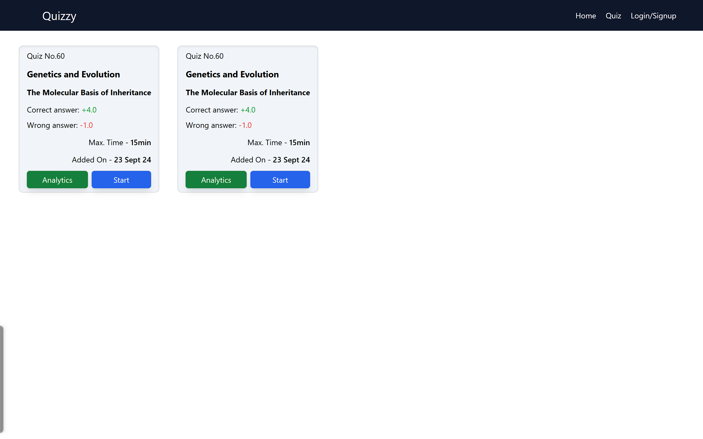
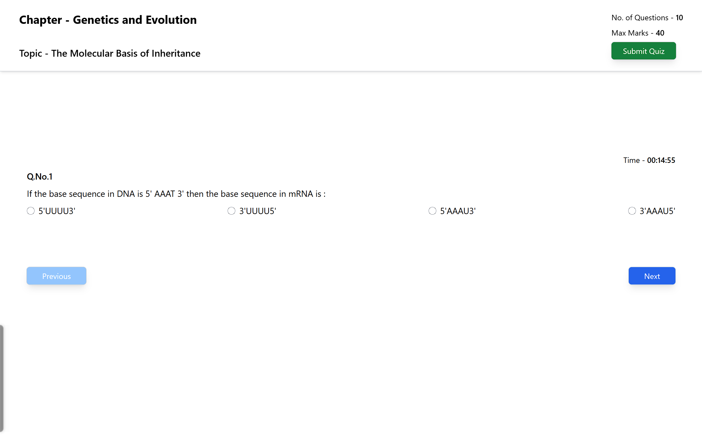
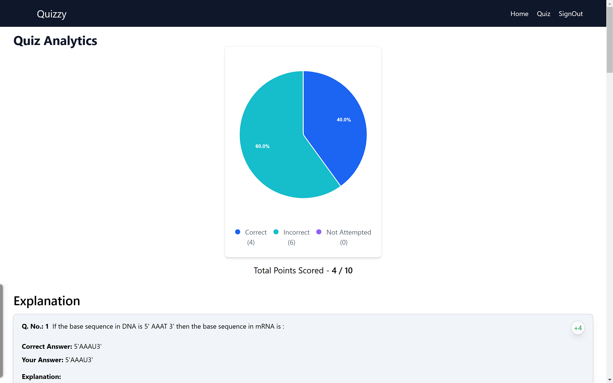

# 📚 Quizzy - The Ultimate Quiz Website

🚀 **Live Demo:** [Quizzy](https://quizzy-jade.vercel.app/)

**Quizzy** is a feature-rich quiz platform built using **SvelteKit**, **DynamoDB**, and the **Quiz API**.  
It offers a clean and modern UI powered by **Tailwind CSS** and **Flowbite UI**.  
The platform provides **detailed analytics and solutions** to enhance the quiz experience.


---

## 🚀 Features

- ✔️ **User-Friendly UI** – Built with **SvelteKit** for a fast and interactive experience.
- ✔️ **DynamoDB Integration** – Scalable and efficient database for storing quiz data.
- ✔️ **Dynamic Quiz API** – Fetch real-time quizzes and questions.
- ✔️ **Detailed Analytics** – View accuracy, attempted questions, and topic-wise stats.
- ✔️ **Solutions & Explanations** – Get correct answers with explanations after each quiz.
- ✔️ **Responsive Design** – Mobile-friendly layout with Tailwind CSS.

---

## 📸 Screenshots

### 🎯 Quiz Attempt Page





### 📊 Quiz Analytics



---

## 🛠️ Tech Stack

- **Frontend:** SvelteKit, Tailwind CSS, Flowbite UI
- **Backend:** DynamoDB, Quiz API
- **Deployment:** Vercel / AWS

---

## 🎮 Getting Started

### 🔧 Installation

```sh
git clone https://github.com/Ayushkumar48/quizzy.git
cd quizzy
npm install
npm run dev
```
